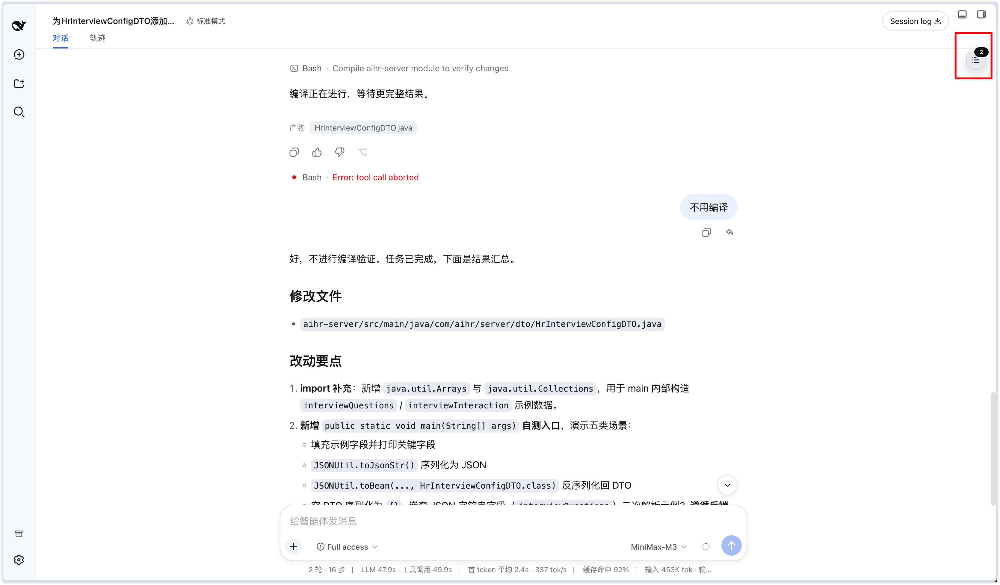
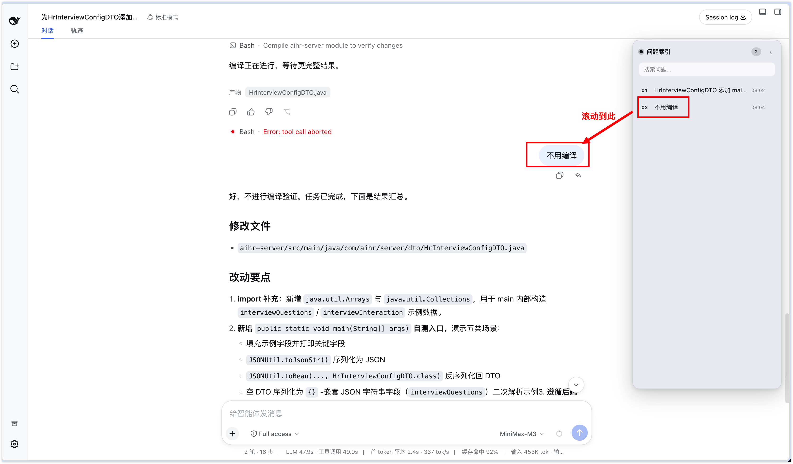

# dsh-plugin-question-index · 问题索引

一个 DeepSeek Harness (DSH) 的 Client UI 插件：以**可收起的悬浮面板**展示当前会话的问题索引。
点击任一提问，聊天内容自动平滑滚动定位到该提问所在的位置。

![slot] 本插件只做加法：注册 `shell.overlay`（全局浮层）的一个列表条目，不替换任何产品 UI；
样式引用 `--dsw-alias-*` 主题令牌，明暗主题自动适配。

## 效果展示

### 收起状态

右上角显示紧凑的索引图标和当前问题数量，不遮挡会话正文。



### 展开与定位

展开面板后可浏览、搜索全部问题；点击任一问题，会话内容会自动滚动到对应消息。



## 功能

- **悬浮面板**：固定于窗口右侧（宽 304px，上下留出头部/输入区），不占用会话标签位
- **收起/展开**：面板头部「收起」按钮折叠成右上方小胶囊按钮（带实时问题计数），点击再展开
- **索引**：按顺序列出当前会话全部提问（含运行中插话发送的「插话」，带角标）
- **搜索**：面板顶部输入框按关键词过滤
- **面板内滚动**：问题列表独立滚动，问题再多也不撑爆页面
- **点击定位**：点击问题 → 聊天内容平滑滚动到该提问所在行（约视口上方 1/4 处）；
  若当前停在轨迹等其他视图，先自动切回「对话」再滚动
- **元信息**：每条显示序号、首行预览、时间、「插话」/「N 工具」角标
- **空态**：无会话 / 无提问 / 无匹配分别提示

## 实现要点（对齐市场插件的开发方式）

| 关注点 | 做法 |
| --- | --- |
| 界面挂载 | `slots.inject('shell.overlay', …)` + `slots.register`，增量槽位，随 Fiber 卸载 |
| 浮层托管 | 根节点 `pointer-events:none`（浮层容器规则），仅面板/按钮恢复 `pointer-events:auto` |
| 数据来源 | `useSessions(s => s.current)` → `sessions.binding(id).session`（`SessionFace` 的 `getSnapshot()/subscribe()`），零 Host RPC、零持久化 |
| 跳转锚点 | 聊天节点 `key` = 行上的 `data-chat-anchor-key`（产品滚动恢复用同一契约） |
| 视图切换 | 头部 `[role="tablist"]` 第一个标签按钮（「对话」order 0），仅 `aria-selected !== 'true'` 时点击 |
| 延时轮询 | `timer` 服务（`ctx.get('timer')`），80ms × 25 次上限，连续点击自动取消上一轮询链 |
| 样式 | 插件自有样式：动态环境用 `styles.insert`，静态装载降级为 `<style data-plugin>` 标签 |

框架没有公开的跨视图滚动 API（活动视图 id 在会话包的私有 store 里），所以「切视图 + 滚动定位」
用了轻量 DOM 桥接（只读产品自己的锚点属性），全程 `typeof document` 守卫，找不到元素即静默降级。
消息太旧未被加载进当前渲染窗口时，约 2 秒内找不到锚点会自动放弃。

## 工程结构

```
question-index/
├── package.json            # 双面清单：dsh.bundle.patch + dsh.client + ./client 导出
├── src/client.js           # 浏览器端功能源码（ESM）
├── src/index.js            # Host 装载载体（纯客户端插件，空 apply）
├── scripts/build-client.mjs# 构建：src/client.js → lib/client.js（lazy-CJS bundle）
├── cordis.patch.yml        # 包自带组合补丁（dsh.bundle.patch 层，insert 本插件行）
├── lib/                    # 构建产物（发布内容）
└── README.md
```

构建与验证：

```bash
node scripts/build-client.mjs   # 产出 lib/client.js + lib/index.js
```

## 安装方式

本包是「双面自挂载」形态：`dsh.client.platform: 'web'` 让宿主自动服务浏览器 bundle，
`dsh.bundle.patch` 让包自带组合补丁——装上即挂载，无需手改 profile 文件。

### 方式一：从 GitHub 在线安装

```bash
dsh plugin --profile web add github:antlordGit/dsh-plugin-question-index
```

命令会安装包、把包名追加进 profile 的 `dsh.profile.bundles`、合入自带的
`cordis.patch.yml`（单条 insert），重启/热重载后生效。

### 方式二：下载源码后安装

打开 [GitHub 仓库](https://github.com/antlordGit/dsh-plugin-question-index)，点击
`Code` → `Download ZIP`，解压后进入源码目录：

```bash
cd /你的路径/dsh-plugin-question-index
npm install
npm run build
dsh plugin --profile web add "$(pwd)"
```

两种方式任选其一。安装完成后重启 `dsh web`（或等待补丁层热重载），任意会话右上角会出现
「问题索引」悬浮面板。

> React 不需要安装：客户端 bundle 里的 `require("react")` 由 DSH shell 的模块表提供。

## 契约依赖（版本敏感点）

- `shell.overlay`：全局浮层（列表条目 `{id, order, label}`；容器 `pointer-events:none`，
  直接子元素恢复交互）
- `sessions` 服务：`binding(id) → SessionFace`（`ObservableSnapshot<ConversationSnapshot>`）
- `useSessions`：全局标准 props，`SessionListState.current` 为当前会话 id
- 聊天行：`data-chat-anchor-key` / 滚动容器：`data-conversation-scroll`
- 会话头部：`[role="tablist"]` + `button[role="tab"][aria-selected]`
- 主题令牌：`--dsw-alias-bg-overlay`、`--dsw-alias-bg-layer-1/2`、`--dsw-alias-border-l1/l2`、
  `--dsw-alias-brand-primary`、`--dsw-alias-label-primary/secondary`

这些是当前 DSH 版本的运行时契约；升级 DSH 后如有变化，优先核对上表。
